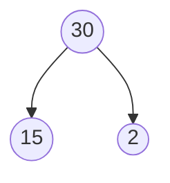

- Factoring is nothing but just take a factor the number

example


- $x^2-6x+8$  by factoring the given eqution is
> $x^2-4x- 2x+8$  
> $x(x-4)-2(x-4)$
> $(x-4)(x-2)$
>```mermaid
>	flowchart TD
>	A((8x^2))-->B(('-4x'))
>	A --> C(('-2x'))	
>```

